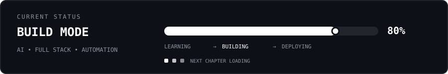
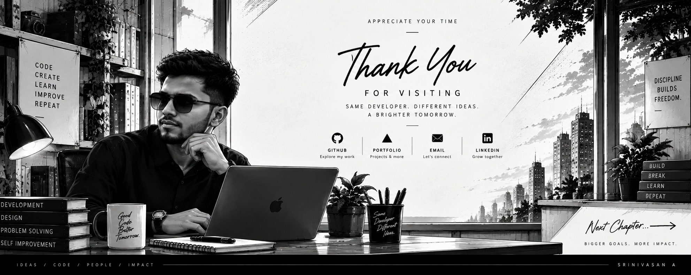

<div align="center">
  
</div>

<div align="center">

`FULL STACK DEVELOPER` · `AI BUILDER` · `CSE`

**Building practical web applications, AI experiences and creative interfaces.**

[Portfolio](https://e-portfoliosrinivasan.vercel.app/) · [GitHub](https://github.com/SRINIVASANashok) · `madarasrini@gmail.com`

</div>

---

## 02 — `SKILL SETS`

<div align="center">

`JavaScript` `TypeScript` `React` `Next.js` `Node.js` `Express` `Python`

`HTML` `CSS` `Gemini API` `Artificial Intelligence` `Machine Learning`

`Git` `GitHub` `Vercel` `VS Code` `Google AI Studio` `Figma`

</div>

---

<div align="center">
  
</div>

### Selected repositories

- **APEX-HQ** — centralized crime monitoring and image-analysis project.
- **RJ Boutique** — AI-powered e-commerce platform with admin, chatbot and recommendation features.
- **Fraud Detection with AI** — AI-based fraud/spam detection project.
- **NeuroLearn** — AI learning / hackathon project.
- **MedAIton** — healthcare-focused hackathon project.
- **e-portfolio** — 3D interactive developer portfolio.

---

## 04 — `CURRENTLY`

<div align="center">
  
</div>

▸ Building AI-powered applications  
▸ Improving full-stack architecture  
▸ Exploring intelligent automation  
▸ Experimenting with creative web experiences  
▸ Turning hackathon ideas into real products

## 05 — `GITHUB ACTIVITY`

<div align="center">


<br>

[Open my GitHub profile →](https://github.com/SRINIVASANashok)

</div>

---

## 06 — `PHILOSOPHY`

<div align="center">

```text
LEARN → BUILD → BREAK → DEBUG → IMPROVE → DEPLOY
```

### `「 DON'T JUST WRITE CODE. BUILD SOMETHING THAT MATTERS. 」`

</div>

---

<div align="center">
  
</div>
